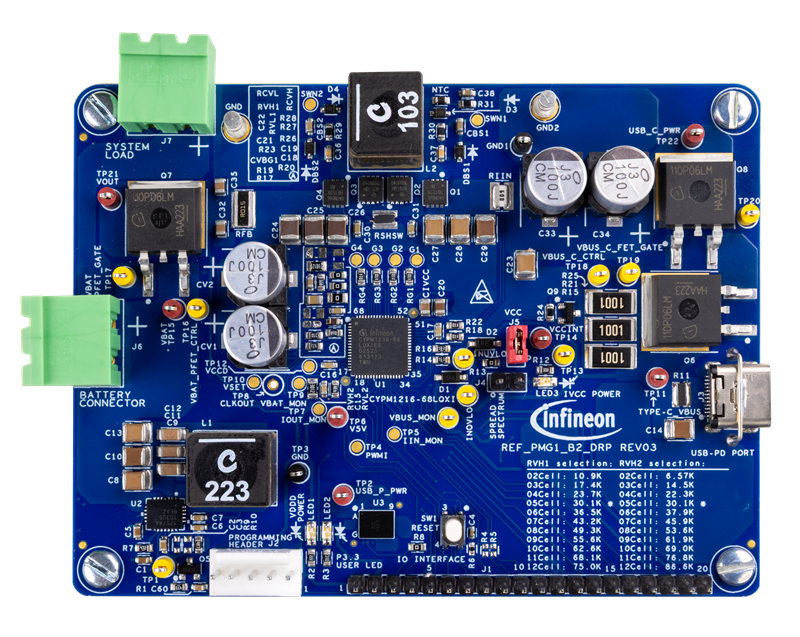

# REF_PMG1_B2_DRP BSP

## Overview

The REF_PMG1_B2_DRP Prototyping kit is a development platform to design products from the EZ-PD™ PMG1-B2  MCU is targeted at applications that require USB PD integrated battery charging up to 240 W for 2 to 12  cell battery, functioning as a USB PD Sink or USB PD DRP device and leverage the MCU to provide additional  control capability.

To use code from the BSP, simply include a reference to `cybsp.h`.

## Features

### Kit Features:

* Support for single Port USB PD 3.2 Source/Sink Role (DRP)
* Support 240W sink operation and 27W source operation
* Support USB bus/battery powered operation
* KitProg3 based programming and debug interface
* Access to the pins of PMG1-B2 silicon (CYPM1216-68LQXI) in hardware and support for BSP, PDL and Middleware in ModusToolbox

### Kit Contents:

* EZ-PD CYPM1216-68LQXI based board
* Quick Start Guide

## BSP Configuration

The BSP has a few hooks that allow its behavior to be configured. Some of these items are enabled by default while others must be explicitly enabled. Items enabled by default are specified in the bsp.mk file. The items that are enabled can be changed by creating a custom BSP or by editing the application makefile.

Components:
* Device specific category reference (e.g.: CAT1) - This component, enabled by default, pulls in any device specific code for this board.

Defines:
* CYBSP_WIFI_CAPABLE - This define, disabled by default, causes the BSP to initialize the interface to an onboard wireless chip if it has one.
* CY_USING_HAL - This define, enabled by default in some BSPs, specifies that the HAL is intended to be used by the application. This will cause the BSP to include the applicable header file and to initialize the system level drivers.  Newer BSPs pull in the v3.x HAL, which enables itself via its own makefile, so CY_USING_HAL is not present.
* CYBSP_CUSTOM_SYSCLK_PM_CALLBACK - This define, disabled by default, causes the BSP to skip registering its default SysClk Power Management callback, if any, and instead to invoke the application-defined function `cybsp_register_custom_sysclk_pm_callback` to register an application-specific callback.

### Clock Configuration

| Clock    | Source    | Output Frequency |
|----------|-----------|------------------|
| CLK_HF   | CLK_IMO   | 48 MHz           |

See the [BSP Setttings][settings] for additional board specific configuration settings.

## API Reference Manual

The REF_PMG1_B2_DRP Board Support Package provides a set of APIs to configure, initialize and use the board resources.

See the [BSP API Reference Manual][api] for the complete list of the provided interfaces.

## More information
* [REF_PMG1_B2_DRP BSP API Reference Manual][api]
* [REF_PMG1_B2_DRP Documentation](https://www.infineon.com/evaluation-board/REF-PMG1-B2-DRP)
* [Infineon Technologies AG](http://www.infineon.com)
* [Infineon GitHub](https://github.com/infineon)
* [ModusToolbox&trade;](https://www.infineon.com/design-resources/development-tools/sdk/modustoolbox-software)

[api]: https://infineon.github.io/TARGET_REF_PMG1_B2_DRP/html/modules.html
[settings]: https://infineon.github.io/TARGET_REF_PMG1_B2_DRP/html/md_bsp_settings.html

---
© Infineon Technologies AG or an affiliate of Infineon Technologies AG, 2019-2026.